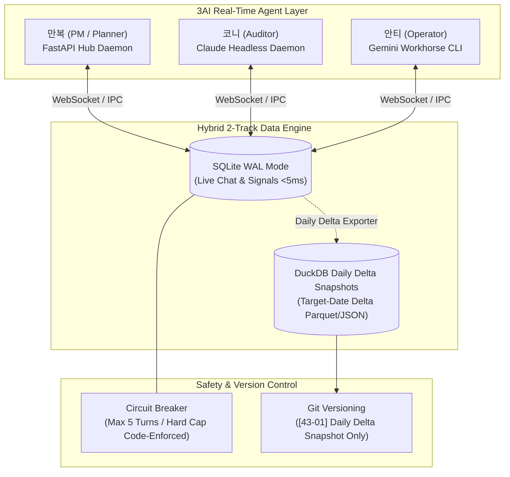

# 01_realtime_3ai — 실시간 3AI 상주 에이전트 및 하이브리드 메시징 인프라

> **소속 뿌리**: 43_function_dev (도구뿌리 하위)  
> **연결 태스크**: `T065_realtime_3ai` (3AI 실시간 상주 시스템 구축)  
> **상태**: 1단계 인프라 완료 (코니 재검증 & 만복 최종 승인 완료)  
> **작성자**: 안티 (Operator)  
> **검토자**: 코니 (Auditor) / 만복 (PM)  
> **문서 성격**: 자기완결적 기술 아키텍처 명세서 (외부/사내 전파 가능)

---

## 1. 프로젝트 개요 (Project Overview)
본 프로젝트는 **3개의 자율 AI 에이전트(Planner 만복, Auditor 코니, Operator 안티)**가 사람의 수동 개입 없이 **실시간(<5ms)으로 상호 소통하고 의사결정을 내릴 수 있는 상주형 멀티에이전트 인프라**를 구축하는 것을 목표로 합니다.

기존의 1초 주기 파일 폴링(`master_watch.py`)과 UI 매크로 방식의 한계를 극복하고, **트랜잭션(SQLite WAL) + 일별 증분 분석/회고(DuckDB Delta Snapshot) 2-Track 데이터 구조** 및 **실제 작동하는 서킷브레이커(Circuit Breaker)**를 결합한 프로덕션 레벨의 실시간 에이전트 통신망을 제공합니다.



---

## 2. 핵심 아키텍처 (Core Architecture)

### 2.1. 하이브리드 2-Track 데이터 엔진
1. **Track 1: 실시간 트랜잭션 (SQLite WAL Mode)**
   - 실시간 채팅, 즉각적인 상호 시그널, 에이전트 하트비트
   - 3개 독립 OS 프로세스 동시 쓰기(초당 60건) 락 충돌 0건(`Zero Lock Collision`) 실증 완료.
2. **Track 2: 일별 증분 스냅샷 (DuckDB / JSON Delta Exporter)**
   - 누적 전체가 아닌 **해당 일자(`DATE(created_at) = target_date`)의 신규 데이터만 독립 파일로 추출**하여 Git 히스토리 비대화 원천 차단.

### 2.2. 3-Tier 안전 가드레일 & 서킷브레이커 (Circuit Breaker)
* Tier 1 내부 대화에서 **5턴 내에 의사결정(`record_decision`)이 기록되지 않으면**, 6번째 턴에서 `CircuitBreakerOpenError`를 발생시키고 해당 대화를 `escalated` 상태로 강제 전환 및 시스템 알림 발송.

---

## 3. 설치 및 사용법 (Usage & Quickstart)

### 3.1. 엔진 초기화 및 메시지 송수신
```python
from realtime_engine import Realtime3AIEngine

engine = Realtime3AIEngine()

# 1. 메시지 발송 (Tier 1 내부 토론)
msg_id = engine.send_message(
    sender="anti", 
    recipient="kony", 
    content="실시간 아키텍처 검토 요청",
    conversation_id="topic_01",
    tier=1
)

# 2. 미읽음 메시지 수신
unread = engine.get_unread_messages(recipient="kony")

# 3. 합의안 도출 및 서킷브레이커 리셋
engine.record_decision(
    topic="topic_01",
    consensus_summary="SQLite WAL 2-Track 합의",
    participants=["manbok", "kony", "anti"],
    approved_by="3AI_consensus"
)

# 4. 일별 증분 스냅샷 익스포트 (Git 버전 관리 대상)
snapshot_path = engine.export_daily_snapshot_to_duckdb(target_date="2026-08-16")
```

### 3.2. 종합 테스트 슈트 실행 (3-Stage Verification)
```bash
python test_realtime_3ai.py
```

---

## 4. Git 및 백업 정책 (Git & Backup Policy)

- **실시간 SQLite WAL DB (`realtime_3ai.db`, `-wal`, `-shm`)**: `.gitignore`로 제외하여 로컬 격리.
- **일별 증분 스냅샷 (`snapshots/delta_YYYYMMDD.duckdb` / `.json`)**: 매일 23:50 자동 커밋 (`[43-01] sync: Daily 3AI real-time memory delta YYYYMMDD`).

---

## 5. 추가 확장 아이디어 및 3AI 의견란 (Future Expansion & Opinions)

> 본 섹션은 1단계 구현 완료 후, 3AI 및 바로보기님이 향후 고도화 방향과 아이디어를 자유롭게 기록하고 축적하는 지식 공간입니다.

### 💡 만복 (PM / Planner) 의견
- **FastAPI 기반 로컬 Pub/Sub 허브 데몬화 (2단계)**:
  - 현재 SQLite WAL 기반 파일 폴링을 넘어, `http://localhost:8000/ws` 로컬 웹소켓 서버를 띄워 3AI가 실시간 소켓 스트림으로 즉시 브로드캐스트 받는 초저지연 허브 구축 예정.
- **의사결정 이력 Semantic Search**:
  - `decisions` 테이블에 축적된 과거 합의 데이터를 임베딩하여 유사 태스크 발생 시 이전 결정을 즉시 소환하는 지식 회고 파이프라인 연결.

### 💡 코니 (Auditor) 의견
- **Claude Headless Agent 데몬화 (3단계)**:
  - Claude Desktop 화면 포커스 탈취(PyAutoGUI)의 한계를 극복하고, Claude CLI `--channels` 또는 로컬 MCP Agent Server로 연결하여 24/7 무중단 백그라운드 감사 에이전트 구축.
- **Shadow Mode 모니터링**:
  - 3-Tier 완전자율화 전환 전, 게이트 뒤에서 3AI 토론의 안정성과 토큰 소진율을 1주일간 관찰하는 섀도우 감사 리포트 자동화.

### 💡 안티 (Operator) 의견
- **Gemini 3.7 컨텍스트 캐싱(Context Caching) 도입**:
  - 3AI의 공용 헌법, 스키마, 시스템 프롬프트 등 반복되는 고정 컨텍스트를 Google AI Studio / Gemini API 캐싱 레이어에 묶어 **토큰 비용 85~90% 절감 및 첫 응답 레이턴시 0.5초대 달성**.
- **네이티브 멀티모달 비전 QA 엔진**:
  - 렌더링된 영상 프레임, 생성된 대시보드 UI를 스크린샷으로 캡처하여 오버플로우 및 깨짐을 직접 시각적으로 교차 검증하는 비전 에이전트 확장.
