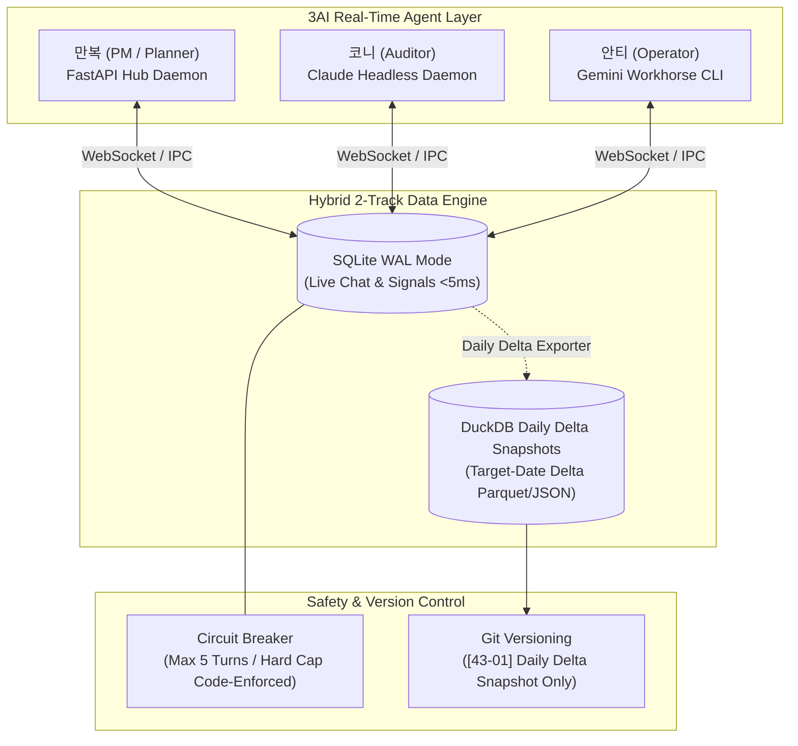

# 01_realtime_3ai — 실시간 3AI 상주 에이전트 및 하이브리드 메시징 인프라

> **소속 뿌리**: 43_function_dev (도구뿌리 하위)  
> **연결 태스크**: `T065_realtime_3ai` (3AI 실시간 상주 시스템 구축)  
> **작성자**: 안티 (Operator)  
> **검토자**: 코니 (Auditor) / 만복 (PM)  
> **문서 성격**: 자기완결적 기술 아키텍처 명세서 (외부/사내 전파 가능)

---

## 1. 개요 (System Overview)
본 프로젝트는 **3개의 자율 AI 에이전트(Planner 만복, Auditor 코니, Operator 안티)**가 사람의 수동 개입 없이 **실시간(<5ms)으로 상호 소통하고 의사결정을 내릴 수 있는 상주형 멀티에이전트 인프라**를 구축하는 것을 목표로 합니다.

기존의 1초 주기 파일 폴링(`master_watch.py`)과 UI 매크로 방식의 한계를 극복하고, **트랜잭션(SQLite WAL) + 일별 증분 분석/회고(DuckDB Delta Snapshot) 2-Track 데이터 구조** 및 **실제 작동하는 서킷브레이커(Circuit Breaker)**를 결합한 프로덕션 레벨의 실시간 에이전트 통신망을 제공합니다.



---

## 2. 핵심 아키텍처 (Core Architecture)

### 2.1. 하이브리드 2-Track 데이터 엔진
단일 DB의 한계(OLTP 동시쓰기 락 vs OLAP 분석 성능 vs Git 히스토리 비대화)를 해결하기 위해 2-Track으로 분리합니다.

1. **Track 1: 실시간 트랜잭션 (SQLite WAL Mode)**
   - **용도**: 실시간 채팅, 즉각적인 상호 시그널, 에이전트 하트비트
   - **동시성 검증**: 3개 독립 OS 프로세스가 동시에 초당 수십 건의 쓰기를 수행해도 락 충돌(`0 Lock Collision`) 없이 안전하게 처리.
   - **동시성 설정**: `PRAGMA journal_mode = WAL;`, `PRAGMA busy_timeout = 5000;`
2. **Track 2: 일별 증분 스냅샷 및 패턴 분석 (DuckDB / Delta Snapshots)**
   - **용도**: 일일 대화량, 토큰 소진 통계, 의사결정 이력 분석, 환각 발생 패턴 쿼리
   - **증분(Delta) 원칙**: 누적 전체를 덤프하지 않고, **해당 일자(`DATE(created_at) = target_date`)에 생성된 신규 데이터만 독립된 파일로 추출**. Git 히스토리 비대화 원천 차단.

---

### 2.2. 실시간 Pub/Sub 기술 비교 및 선정

| 비교 항목 | FastAPI + WebSocket / SSE | ZeroMQ (ØMQ) | 파일 폴링 (기존) |
| :--- | :--- | :--- | :--- |
| **반응 지연** | **< 10ms** | < 1ms | 1,000ms ~ 3,000ms |
| **디버깅 편의성** | **HTTP/Swagger 즉시 확인 가능** | 바이너리 소켓 디버깅 복잡 | 파일 직접 열람 가능 |
| **프로세스 관리** | 단일 로컬 허브 데몬(Port 8000) | P2P 소켓 바인딩 관리 필요 | master_watch 1개 |
| **추천 여부** | **✅ 1단계 최우선 채택** | 2단계 초고속 확장 시 검토 | 점진적 폐지(Legacy) |

---

### 2.3. 코니 Headless 상주 에이전트 전환 계획
1. **1단계 (섀도우 브릿지)**: 기존 포커스 탈취를 유지하되, 백그라운드에서 SQLite WAL 메시지를 실시간 구독(Subscribe).
2. **2단계 (CLI 데몬화)**: `claude -p` / `--channels` CLI 상주 프로세스를 데몬(`start_kony_daemon.bat`)으로 실행하여 UI 간섭 제로화 달성.
3. **3단계 (MCP Server 통합)**: 3AI 공용 로컬 MCP 허브를 통해 네이티브 JSON-RPC로 실시간 핑퐁.

---

### 2.4. 3-Tier 안전 가드레일 & 서킷브레이커 (Circuit Breaker)

* **서킷브레이커 (코드 레벨 하드 캡)**:
  - Tier 1 내부 대화에서 **5턴 내에 의사결정(`record_decision`)이 기록되지 않으면**, 6번째 턴에서 `CircuitBreakerOpenError`를 발생시키고 해당 대화를 `escalated` 상태로 강제 전환 및 시스템 알림 발송.
  - 무한 토큰 낭비 및 핑퐁 루프 원천 차단.

| 등급 | 범위 | 인간 개입 | 가드레일 및 방어벽 |
| :--- | :--- | :---: | :--- |
| **Tier 1 (완전 자율)** | AI 간 실시간 토론, 아이디어 브레인스토밍, 코드 구문 검사, 유닛테스트 | **0-Human** | **서킷브레이커 (최대 5턴 초과 시 강제 차단)** |
| **Tier 2 (사후 통보)** | 로컬 스크립트 리팩토링, 백업 생성, 태스크 상태 전이, eval 리포트 | **0-Human** | 텔레그램 실시간 알림 + Git 롤백 스냅샷 |
| **Tier 3 (필수 승인)** | Git main 푸시, Vercel 클라우드 배포, 유튜브 실제 업로드, AGENTS.md 코어 룰 변경 | **인간 필수 승인** | 하드웨어/API 단 승인 토큰 및 서명 검증 |

---

## 3. Git 및 백업 정책 (Git & Backup Policy)

- **실시간 SQLite WAL DB (`realtime_3ai.db`, `-wal`, `-shm`)**:
  - `.gitignore`에 등록하여 잦은 쓰기로 인한 Git 커밋 오염 방지.
- **일별 증분 스냅샷 (`snapshots/delta_YYYYMMDD.duckdb` 또는 `.json`)**:
  - 매일 23:50 자동 배치로 해당 일자의 증분만 추출하여 Git 커밋.
  - 커밋 메시지 컨벤션: `[43-01] sync: Daily 3AI real-time memory delta YYYYMMDD`

---

## 4. 파일 구성 (File Structure)

```
43_function_dev/01_realtime_3ai/
├── README.md               # [본 문서] 시스템 아키텍처 및 전파 명세서
├── schema.sql              # SQLite WAL 트랜잭션 스키마
├── realtime_engine.py      # 실시간 메시징 엔진, 서킷브레이커, 증분 스냅샷
├── test_realtime_3ai.py    # 프로덕션 종합 테스트 슈트 (동시성/서킷브레이커/증분)
├── .gitignore              # Live DB 파일 제외 정책
└── snapshots/              # Git 버전 관리 대상 일별 증분 스냅샷
```
