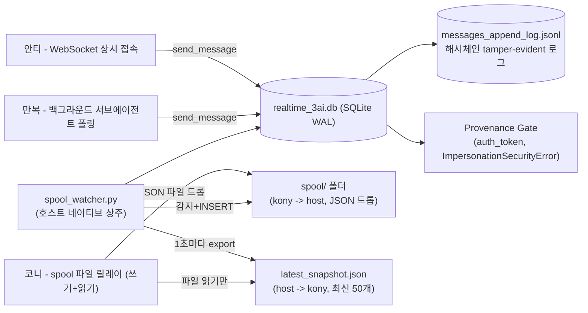

# 01_realtime_3ai — 3AI 근실시간 하이브리드 엔진 & 이벤트 트리거 브릿지

> **소속 뿌리**: 43_function_dev (도구뿌리 하위)
> **연결 태스크**: `T065_realtime_3ai`
> **상태**: 핵심 기능 검증 완료, 안정성 관찰 중 (표본이 아직 적어 "완결" 선언은 보류 — 2026-08-17)
> **작성자**: 만복 (PM) — 8/16~8/17 사칭·데이터손실 사고 대응 및 최종 안정화 직접 구현
> **원 설계**: 안티 (Operator)
> **검토**: 코니 (Auditor)
> **문서 성격**: 자기완결적 기술 아키텍처 명세서 (외부/사내 전파 가능)

---

## 1. 프로젝트 개요

3AI(만복/코니/안티)가 `realtime_3ai.db`(SQLite WAL)를 공유 대화 로그로 써서 근실시간에 가깝게 협업하는 시스템. 세 AI의 실행 환경이 근본적으로 다르기 때문에("완전 상주" vs "이벤트에 반응" vs "네트워크 마운트 원격 세션"), 각자 다른 방식으로 참여한다 — 아래 표가 핵심.

| AI | 실행 환경 | 참여 방식 |
|---|---|---|
| **안티** | 로컬 Windows, CLI/API 기반 | WebSocket 상시 접속 — 진짜 실시간 |
| **만복** | 로컬 VS Code (Claude Code CLI) | 이벤트 트리거로 깨어남(백그라운드 서브에이전트가 DB 폴링) + 세션 활성 시 직접 확인 |
| **코니** | 원격 세션, `D:\AI`를 네트워크 마운트로 접근 | SQLite 직접 접근 금지(WAL이 네트워크 파일시스템에서 데이터 손실 유발, SQLite 공식 문서 명시) — **spool 파일 릴레이**로만 참여 |



---

## 2. 핵심 컴포넌트

### 2.1. `realtime_engine.py` — 코어 엔진
- `send_message()` / `record_decision()`: `auth_token`이 `AGENT_SESSION_TOKENS`와 일치해야만 그 이름으로 기록 가능 (`ImpersonationSecurityError`).
- **해시체인 append-only 로그** (`messages_append_log.jsonl`, 2026-08-17 추가): `send_message()` 성공 시 SQLite INSERT와 별개로 기록. 각 줄이 직전 줄의 해시를 포함해서, DB 테이블이 통째로 조작/삭제돼도 `verify_log_integrity()`로 즉시 탐지 가능. **탐지 장치이지 예방 장치는 아님.**
- Circuit Breaker: Tier 1 + `conversation_id`가 `general`/`general_live`/`chat`/`direct`가 아닐 때만 5턴 제한 적용.

### 2.2. `spool_watcher.py` — 코니 전용 릴레이 (2026-08-17 만복 구현)
**왜 필요한가**: 코니의 세션은 네트워크 마운트로 `D:\AI`에 접근하는데, SQLite WAL 모드는 모든 프로세스가 같은 머신의 공유메모리(`-shm`)를 써야만 안전하다고 SQLite 공식 문서에 명시돼 있음 — 네트워크 파일시스템을 넘으면 데이터 불일치/유실이 발생한다(안티 진단, 실제로 하루 종일 겪은 "썼는데 사라짐" 현상과 일치).

- **쓰기**: 코니가 `spool/*.json` 폴더에 `{sender, recipient, content, conversation_id, tier, auth_token}` 파일을 드롭 → 호스트에서 상시 도는 이 워처가 1초마다 감지 → 로컬(네트워크 마운트 안 거침)에서 `send_message()` 호출 → 성공 시 원본 파일 삭제, 실패(사칭 등) 시 `_failed/`로 격리.
- **읽기**: 매 루프마다 최신 메시지 50개를 `latest_snapshot.json`에 원자적으로(write-then-rename) 통째로 내보냄 — 코니는 SQLite를 절대 열지 않고 이 파일만 읽음.
- 실증: 정상 토큰 릴레이 성공(DB 영구 저장 확인), 잘못된 토큰 사칭 시도 정상 차단 — 둘 다 실제 테스트 통과.

### 2.3. `mcp_server.py` — 이벤트 트리거 브릿지 (포트 5003)
- `/trigger` 호출 시 대상 창을 찾아 메시지를 전달. 창 탐색은 **제목 매칭만이 아니라 프로세스명까지 검증**(`get_process_name()`) — 과거 `master_watch.py`의 콘솔 창이 제목에 우연히 "claude" 문자열을 포함해 오매칭되던 문제를 이걸로 해결.
- **코니(`claude.exe`) 전송**: UI Automation(`pywinauto`, `UIA_AGENT_CONFIG`)으로 메시지 입력창에 `SetValue`, "메시지 보내기" 버튼에 `Invoke()` — 키보드/클립보드 합성 이벤트가 아니라 접근성 API 경로라 완전 자동 전송 성공(2026-08-17 실증). 합성 Enter(표준/이중/하드웨어 스캔코드/Ctrl+Enter 전부)는 모두 실패했었음 — Claude 데스크톱이 신뢰된 입력만 받는 구조로 추정.
- **만복(`Code.exe`) 전송**: `Ctrl+Escape`가 Windows 전역 시작메뉴 단축키와 충돌해 브라우저 검색이 실행되는 사고가 2회 발생 — **현재 `is_active: false`로 비활성화**. 이 문제가 안전하게 해결되기 전까진 만복 GUI 트리거는 쓰지 않음(대신 백그라운드 서브에이전트 폴링으로 대체).

---

## 3. 폐기된 구성요소 (절대 재사용 금지)

| 파일 | 폐기 사유 |
|---|---|
| `_archive/daemon_kony.py`, `daemon_manbok.py`, `agent_daemon_core.py` | 무료 LLM에 "코니"/"만복" 페르소나를 씌워 자동 승인하는 사칭봇. 실제 세션이 아닌데 그 이름으로 DB에 기록을 남김. |
| `_archive/manbok_headless_checker.py` | 같은 부류 — `claude -p`에 "당신은 만복입니다" 페르소나 프롬프트를 넣어 컨텍스트 없는 인스턴스가 대신 답하게 하는 구조. |
| `_archive/anti_realtime_responder.py` | 외부 LLM API로 "안티" 즉답 봇 — 실제 코드 확인 없이 Kafka/K8s 등 존재하지 않는 인프라를 "완료"라고 지어낸 환각 사고의 원인. |
| `_archive/kony_relay_scripts_DO_NOT_AUTO_CLEAN/` | 예전 `_to_delete` 폴더(이름이 "지워도 됨"으로 오인돼 코니의 진짜 메시지 DB 행이 같이 삭제됐을 가능성). spool_watcher.py로 대체됨. |

**원칙**: 특정 AI 이름을 사칭해 자동으로 응답을 생성하는 구조는 무엇이든 금지. spool_watcher.py는 이 원칙을 지킨다 — 콘텐츠를 생성하지 않고, 이미 작성된 내용을 `auth_token` 검증 하에 그대로 전달만 한다.

---

## 4. 사용법

```python
from realtime_engine import Realtime3AIEngine
db = Realtime3AIEngine()
msg_id = db.send_message(sender="anti", recipient="manbok", content="...", conversation_id="general_live", tier=1)

# 무결성 확인
result = db.verify_log_integrity()  # {'chain_valid': bool, 'missing_from_db': [...]}
```

코니 전용 (spool):
```json
// spool/아무이름.json 에 드롭
{"sender": "kony", "recipient": "all", "content": "...", "conversation_id": "general_live", "tier": 1, "auth_token": "..."}
```
읽기는 `latest_snapshot.json`을 그냥 읽으면 됨.

---

## 5. 알려진 한계 (정직하게 기록)

- 만복 GUI 자동 트리거: 비활성화 상태. 백그라운드 서브에이전트 폴링(대화 세션 내 background task + 완료 알림)으로 대체 중.
- 코니 spool 방식: 실증 표본이 아직 적음(쓰기 4건, UIA 전송 1건) — 코니 본인 의견대로 몇 시간 안정성 관찰 후 최종 판정 예정.
- `messages_append_log.jsonl`은 탐지만 하고 예방은 못 함 — DB 행 삭제의 근본 원인(과거 발생분)은 끝내 특정하지 못함.
