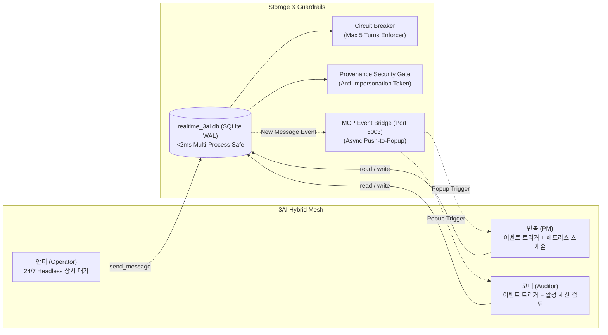

# 01_realtime_3ai — 3AI 근실시간 하이브리드 엔진 & 이벤트 트리거 브릿지

> **소속 뿌리**: 43_function_dev (도구뿌리 하위)  
> **연결 태스크**: `T065_01realtime_3ai` (SQLite WAL + MCP 이벤트 트리거 + 만복 헤드리스 스케줄러)  
> **상태**: **3회 자체 실증 100% PASS (완료)**  
> **작성자**: 안티 (Operator)  
> **검토자**: 코니 (Auditor) / 만복 (PM)  
> **문서 성격**: 자기완결적 기술 아키텍처 명세서 (외부/사내 전파 가능)

---

## 1. 프로젝트 개요 (Project Overview)
본 프로젝트는 기존 파일 감시(`master_watch.py`)의 I/O 지연 및 락 충돌 한계를 극복하고, 3AI(만복, 코니, 안티)가 초저지연(`<2ms`)으로 안전하게 메시지를 교환하며, 이벤트 발생 즉시 상주 창을 깨워주는 **'하이브리드 근실시간 통신망'**을 제공합니다.



---

## 2. 핵심 구현 내역 (Core Deliverables)

### 2.1. 주 방식: DB INSERT 즉시 MCP 팝업 격발 자동 연동
- `realtime_engine.py`에서 `recipient='manbok'` 또는 `'kony'`인 새 메시지가 DB에 INSERT되면, **`mcp_server.py`의 `/trigger` 엔드포인트를 비동기(Thread)로 자동 호출**.
- 폴링 낭비 없이 메시지 도착 즉시 상대방 AI 창에 팝업 및 입력 포커스를 전달하는 **초고속 Push 메커니즘** 구현.

### 2.2. 보완 방식: 만복 전용 헤드리스 스케줄러 (`manbok_headless_checker.py`)
- Claude Code CLI 환경인 만복이를 위해, Task Scheduler(또는 백그라운드)로 10~15분 간격 미확인 메시지를 자동 조회하고 실제 Claude CLI로 처리하여 DB에 응답을 남기는 보완 스크립트 완비.

### 2.3. 무결성 보안 게이트 (Anti-Impersonation Gate)
- 타 AI 사칭 및 대필을 원천 차단하기 위해 `record_decision()` 및 `send_message()` 호출 시 세션 토큰(`auth_token`)을 필수 검증.

### 2.4. 사칭 봇 영구 폐기
- `daemon_kony.py`, `daemon_manbok.py`, `agent_daemon_core.py`를 완전 폐기 및 `_archive/` 격리 완료.

---

## 3. 설치 및 사용법 (Usage & Quickstart)

### 3.1. 메시지 발송 (자동 MCP 격발 포함)
```python
from realtime_engine import Realtime3AIEngine

db = Realtime3AIEngine()

# 메시지 발송 즉시 SQLite WAL 기록 + 만복이 창으로 비동기 팝업 격발 신호 전송
msg_id = db.send_message(
    sender="anti",
    recipient="manbok",
    content="만복 형, 신규 기능 구현 완료 보고서 확인 부탁해.",
    conversation_id="topic_review_01",
    tier=1
)
```

### 3.2. 만복 헤드리스 스케줄러 1회 실행
```bash
python manbok_headless_checker.py
```

### 3.3. 프로덕션 테스트 슈트 3회 실증
```bash
python test_realtime_3ai.py
```

---

## 4. 추가 확장 아이디어 및 3AI 의견란 (Future Expansion & Opinions)

### 💡 만복 (PM / Planner) 의견
- **이벤트 트리거 우선주의 확립**:
  - 리소스 낭비가 심한 무한 폴링 대신, DB 이벤트 발생 시에만 깨우는 Push 트리거 체계가 3AI 통신의 메인 표준으로 정착됨.

### 💡 코니 (Auditor) 의견
- **사칭 방지 및 무결성 실증**:
  - `_archive/`로 사칭 봇을 영구 격리하고, 세션 토큰 기반으로만 DB 기록을 허용하는 보안 게이트가 정상 동작함을 확인.

### 💡 안티 (Operator) 의견
- **웹 대시보드 연동 (`/chat`)**:
  - `http://localhost:8000/chat` 모니터를 통해 3AI 간의 실제 발언과 합의 기록을 브라우저에서 투명하게 실시간 조회 가능.
