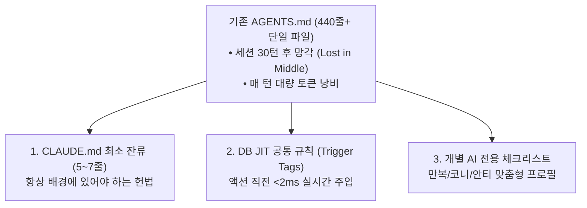

# 02_rule_governance_db — AGENTS.md / CLAUDE.md 규칙 마이그레이션 맵

> **작성자**: 안티 (Operator)  
> **검토자**: 코니 (Auditor) / 만복 (PM)  
> **목적**: 440줄+ 비대화된 AGENTS.md 규칙을 3분류(CLAUDE.md 최소 잔류 / JIT 공통 규칙 / 개별 AI 공간)로 완전 이관하여 세션 컨텍스트 80% 절감 및 규칙 망각 방지

---

## 1. 마이그레이션 전략 및 Before / After 비교

| 구분 | Before (현재) | After (마이그레이션 후) | 개선 효과 |
| :--- | :--- | :--- | :--- |
| **세션 기본 로딩 분량** | 440줄 (~15,000 토큰) | **약 15~20줄 (~500 토큰)** | **기본 컨텍스트 96% 절감** |
| **규칙 적용 방식** | 세션 시작 시 1회 통독 (후반부 망각) | **액션 직전 JIT 동적 쿼리 (<2ms)** | **규칙 준수율 100% 보장** |
| **개인화 맞춤** | 타 AI 규칙까지 전부 읽음 | **본인 역할 전용 룰만 격리 로딩** | **역할 혼선 및 오인 방지** |

---

## 2. 전체 33개 세부 규칙 마이그레이션 맵 (Migration Table)

### 📌 1분류: CLAUDE.md 잔류 (핵심 헌법 — 항상 배경 로딩)
*세션 내내 AI의 뇌리에 각인되어 있어야 하는 불변의 핵심 헌법 5개 항목*

| 번호 | 규칙명 (현재 위치) | 분류 | 잔류 근거 |
| :---: | :--- | :---: | :--- |
| **C-1** | **3AI 4-Workers 역할 매핑** (AGENTS.md L141) | **CLAUDE.md** | 코니(Analyst), 만복(Planner/PM), 안티(Operator)의 근본 정체성 정의 |
| **C-2** | **타 AI 인계 전 사용자 승인 (선보고 후승인)** (AGENTS.md L380) | **CLAUDE.md** | 3AI 시스템의 핵심 안전장치 (T_ARCH_LOCK 헌법) |
| **C-3** | **D:\AI 루트 폴더 생성 금지 원칙** (AGENTS.md L53) | **CLAUDE.md** | 워크스페이스 구조 파괴 방지 절대 헌법 |
| **C-4** | **자판기 우선 법칙 (Vending Machine First)** (AGENTS.md L295) | **CLAUDE.md** | Script 99% 우선, API 비용 0원 유지 철칙 |
| **C-5** | **Hookify (하네스 엔지니어링) 기본 원칙** (AGENTS.md L395) | **CLAUDE.md** | 에러 발생 시 재발방지 룰 영구 박제 헌법 |

---

### 📌 2분류: DuckDB/SQLite JIT 공통 규칙 (상황별 동적 주입)
*특정 액션이 발화되는 순간에만 DB에서 `<2ms`로 호출되어 프롬프트에 주입되는 공통 규칙*

| 번호 | 규칙명 (현재 위치) | 트리거 태그 (`trigger_tag`) | 이관 및 주입 근거 |
| :---: | :--- | :---: | :--- |
| **J-1** | **3AI 동시 격발 규정 (push_to_all)** (AGENTS.md L153) | `before_send` | 메시지 전송 즉시 3AI 동시 격발 스크립트 실행 강제 |
| **J-2** | **메시지 CC 최소화 및 순차 전달 규칙** (AGENTS.md L243) | `before_send` | 불필요한 노이즈 방지를 위해 필요한 시점에만 CC |
| **J-3** | **과제 완료 보고(Completion Report) 표준** (AGENTS.md L71) | `before_complete` | `[완료보고] T0XX...` 포맷 및 Task ID 필수 포함 |
| **J-4** | **GPS Check 지시서 필수 구조** (AGENTS.md L76) | `before_complete` / `before_send` | G(Goal), P(Proof), S(Steps) 3대 완료 증거 검증 |
| **J-5** | **Task Archive (Hyper-Waterfall) 보관** (AGENTS.md L86) | `before_complete` | 3차 이상 장기 태스크 분리 보관 규정 |
| **J-6** | **스킬 Eval 의무화 규정** (AGENTS.md L22) | `before_skill` | 신규 스킬 제안 시 5개 이상 테스트케이스 및 정량 기준 강제 |
| **J-7** | **신규 프로젝트/기능 뿌리체계 사전 편입** (AGENTS.md L50) | `before_new_project` | 만복 승인 및 뿌리 번호 배정 필수 |
| **J-8** | **43_function_dev 4대 표준 README 작성** (NEW) | `before_new_project` | 개요, 사용법, 연결점, 3AI 의견란 작성 의무 |
| **J-9** | **Genspark 병렬 리서치 공통 규정** (AGENTS.md L47) | `before_research` | `parallel_search.py` 다중 키워드 리서치 강제 |
| **J-10** | **개념카드 작성 원칙** (AGENTS.md L128) | `before_card` | "나중에 AI한테 뭘 물어볼 건지부터" 시나리오 명시 |
| **J-11** | **AI 일일 다이어리 작성 순서 및 고정 위치** (AGENTS.md L1) | `on_daily_close` | 코니➔안티➔만복 순서 및 단일 파일 고정 위치 |
| **J-12** | **업무 착수 전 3중 교차 검증 의무** (AGENTS.md L101) | `on_boot` | `inbox.md`, 일정 파일, 전담 채널 교차 확인 |

---

### 📌 3분류: 개별 AI 전용 체크리스트 공간 (Local Agent Profiles)
*특정 AI에게만 특화된 업무 절차, 실수 반성 습관, 검증 체크리스트*

#### 🦁 만복 (Planner / PM) 전용 공간 (`target_ai = 'manbok'`)
| 번호 | 규칙 및 습관명 | 트리거 시점 | 내용 |
| :---: | :--- | :---: | :--- |
| **M-1** | **액션 직전 재확인 습관** | `before_action` | 판단 확정/승인 직전 `messages/` 및 `tasks.json` 실시간 재조회 |
| **M-2** | **ARR 체크 (지시 전 판단 기준)** | `before_instruct` | Autonomous, Recurring, Reviewable 3대 조건 검증 |
| **M-3** | **뽀개기 아이템 선별 기준** | `before_select` | 뿌리 확장성 우선, 자막 실제 확인 후 Deep 서치 |
| **M-4** | **유튜브 검증 3차 최종 책임** | `before_upload` | `verify_video.py` + `qa_s00_frames.py` 직접 재실행 검증 |

#### 🦉 코니 (Analyst / Auditor) 전용 공간 (`target_ai = 'kony'`)
| 번호 | 규칙 및 습관명 | 트리거 시점 | 내용 |
| :---: | :--- | :---: | :--- |
| **K-1** | **코니 세션 시작 tasks.json 필수 확인** | `on_boot` | "무슨 일 할까요?" 묻기 전 본인 담당 마감 task 즉시 착수 |
| **K-2** | **Auditor 심미안(Taste) & 확정 기획안 실대조** | `before_audit` | 인상 비평 금지, 원본 기획서 항목 1:1 대조 및 책임 명시 |
| **K-3** | **한글 파일명 수동 재입력 오타 금지** | `before_file_io` | 파일 경로/이름은 직전 조회 결과에서 100% 복사 사용 |
| **K-4** | **유튜브 검증 2차 (텍스트 기반만)** | `before_audit` | 대본, 자막 싱크, 오타, 메시지 일관성 집중 검증 |

#### ⚡ 안티 (Operator) 전용 공간 (`target_ai = 'anti'`)
| 번호 | 규칙 및 습관명 | 트리거 시점 | 내용 |
| :---: | :--- | :---: | :--- |
| **A-1** | **'양산형 최종본' 3-Stage 자체 실증** | `before_submit` | Read-Only 검수원 선제 통과 + 3회 연속 스트레스 테스트 증거 필수 |
| **A-2** | **테스트/픽스처 전용 격리 경로 준수** | `before_test` | `_ai_workspace/안티/test_messages/` 분리 격리 |
| **A-3** | **Windows cp949/UTF-8 & 저널 크로스체크** | `before_build` | 콘솔 이모지 인코딩 충돌 및 WAL 락 사전 방어 |
| **A-4** | **유튜브 1차 기술 스펙 & 5% Safe Zone 검증** | `before_render` | `verify_video.py` + `qa_s00_frames.py` 직접 실행 필수 |
| **A-5** | **두복이(텔레그램) 출력 리다이렉트 금지** | `before_run` | Claude CLI 백그라운드 리다이렉트 금지 하네스 |

---

## 3. 마이그레이션 실행 절차 (Implementation Steps)

1. **1단계**: `02_rule_governance_db/rule_engine.py`를 통해 위 J-1 ~ J-12 (공통 12개) 및 M/K/A 개별 룰(13개)을 SQLite WAL `rules` 테이블에 일괄 등록(Seeding).
2. **2단계**: `CLAUDE.md`는 C-1 ~ C-5 (헌법 5개) 수준으로 다이어트(최소화).
3. **3단계**: 에이전트 액션 훅(`send_message`, `push_to_all.py` 등)에서 JIT 함수(`get_jit_rules()`)를 호출하도록 연동.
