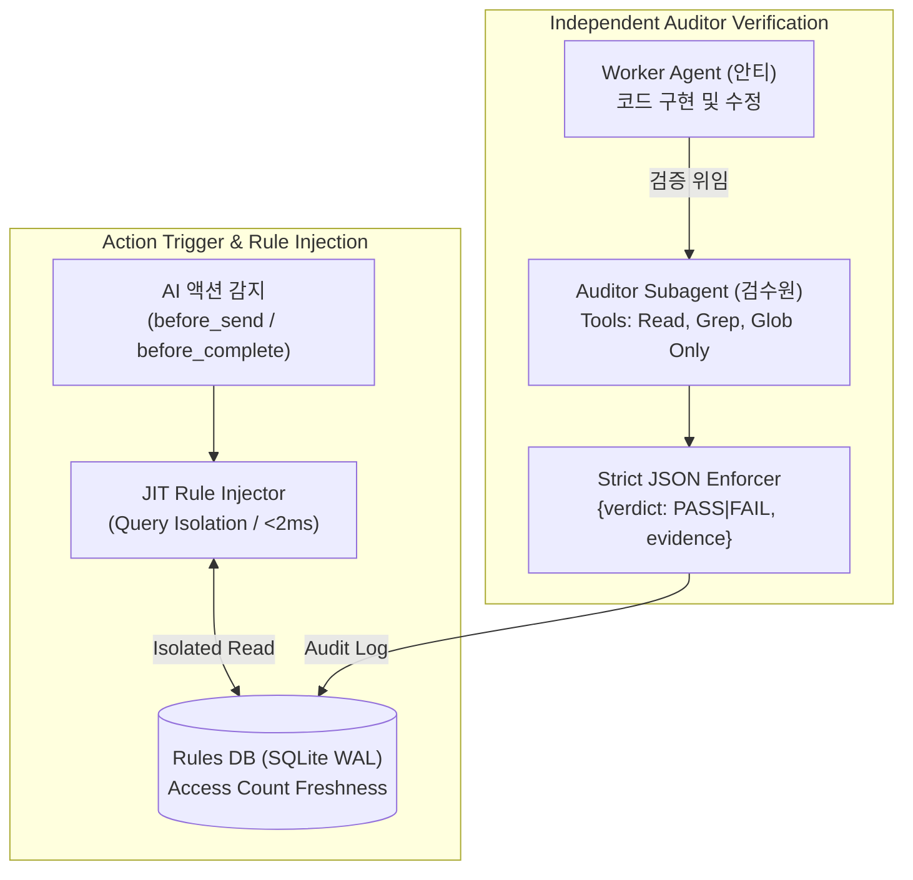

# 02_rule_governance_db — JIT 규칙 거버넌스 & 구조화 검수원 서브에이전트

> **소속 뿌리**: 43_function_dev (도구뿌리 하위)  
> **연결 태스크**: `T066_rule_governance_db` (규칙 거버넌스 DB & 검수원 패턴 구축)  
> **작성자**: 안티 (Operator)  
> **검토자**: 코니 (Auditor) / 만복 (PM)  
> **문서 성격**: 자기완결적 기술 아키텍처 명세서 (외부/사내 전파 가능)

---

## 1. 프로젝트 개요 (Project Overview)
본 프로젝트는 세션이 길어질수록 AI가 규칙을 잊어버리는 **'규칙 망각(Lost in the Middle)'**과, 코드를 작성한 본인이 스스로 통과를 선언하는 **'자기선호 편향(Self-Preference Bias)'**을 시스템 아키텍처 레벨에서 원천 차단하기 위해 구축되었습니다.

`방구석-클로드코드-세팅팩`에서 도출된 핵심 검수 패턴을 발전시켜:
1. 상황에 맞는 규칙만 즉시 로딩하는 **JIT(Just-In-Time) 상황별 규칙 인젝터**
2. Write 권한이 물리적으로 박탈된 **Read-Only 독립 검수원 서브에이전트 (`{"verdict": "PASS"|"FAIL"}`)**
3. `43_function_dev` 및 전역 뿌리 프로젝트의 현황과 지식을 관리하는 **프로젝트 지식 허브**를 제공합니다.



---

## 2. 핵심 아키텍처 및 보강 사항 (Core Architecture)

### 2.1. 검수원 판정 구조화 출력 강제 (Strict JSON Output)
- 자유 텍스트 파싱("통과", "PASS", "문제없음" 등) 시 발생하는 오분류 및 Hallucination을 방지하기 위해 엄격한 JSON 스키마를 강제합니다:
```json
{
  "verdict": "PASS",
  "evidence": "3개 멀티프로세스 동시 쓰기 60건 1.1초 통과 (락 충돌 0건)"
}
```
- `PASS` 또는 `FAIL` 이외의 변형된 문자열이나 JSON 파싱 실패 시 자동으로 `FAIL` 처리 및 에러 로깅.

### 2.2. JIT 트리거 태그 & 코니의 현재 한계 명시
- **안티 및 자동화 스크립트**: `send_message()`, `push_to_all.py` 실행 시점에 `before_send` 훅이 자동으로 작동하여 DB에서 실시간 규칙을 주입받음 (완전 자동).
- ⚠️ **코니의 현재 적용 한계**: 코니는 현재 비상주 Claude Desktop UI 기반이므로, T065 3단계(Headless 데몬화) 이전까지는 세션 시작/액션 시점에 수동 조회가 동반되는 반쪽 적용 상태임. 따라서 "규칙을 잊는 문제"가 "DB 조회를 잊는 문제"로 변형되지 않도록 향후 코니 Headless 데몬화 시 훅으로 강제 통합 예정.

### 2.3. 고빈도 트래픽 쿼리 격리 (Query Isolation)
- 실시간 채팅 DB(`realtime_3ai.db`)와 같은 SQLite WAL 인스턴스를 공유하더라도, 규칙 조회 쿼리는 안전장치로서 초저지연이 보장되어야 합니다.
- **격리 방안**: 규칙 조회 전용 읽기 연결(`PRAGMA query_only = ON;`, `busy_timeout = 2000;`)을 분리하여 대량의 채팅 쓰기 트래픽 중에도 규칙 조회가 블로킹되지 않도록 보호.

---

## 3. 설치 및 사용법 (Usage & Quickstart)

### 3.1. JIT 규칙 등록 및 액션 직전 조회
```python
from rule_engine import RuleGovernanceEngine

engine = RuleGovernanceEngine()

# 1. 상황별 규칙 등록
engine.register_rule(
    rule_id="RULE_BEFORE_SEND_APPROVAL",
    rule_name="선보고 후승인 원칙",
    trigger_tag="before_send",
    rule_body="타 AI 전송 전 반드시 바로보기님의 명시적 승인을 득할 것.",
    target_ai="all"
)

# 2. 액션 직전 JIT 규칙 호출 (신선도 카운트 자동 증가)
jit_rules = engine.get_jit_rules(trigger_tag="before_send", caller_ai="anti")
```

### 3.2. Read-Only 검수원 서브에이전트 검증 실행
```python
# 검수원 명령 실행 (Write 불가 환경에서 테스트 실행 후 엄격 JSON 판정 수신)
test_cmd = [sys.executable, "test_realtime_3ai.py"]
audit_result = engine.run_auditor_verification(
    target_task="T065",
    caller_ai="anti",
    test_command=test_cmd
)
print(audit_result) # {'audit_id': 'aud_...', 'verdict': 'PASS', 'evidence': '...'}
```

### 3.3. 종합 테스트 슈트 실행 (3-Stage Verification)
```bash
python test_rule_governance.py
```

---

## 4. 추가 확장 아이디어 및 3AI 의견란 (Future Expansion & Opinions)

### 💡 만복 (PM / Planner) 의견
- **규칙 신선도 자동 일요 점검 (Freshness Review)**:
  - `access_count == 0`이거나 14일 이상 조회되지 않은 사문화된 규칙을 매주 일요일 DuckDB 스냅샷 집계 쿼리로 자동 추출하여 정리하는 거버넌스 자동화.
- **회사 AI 지식 배포용 Export**:
  - `projects_status` 테이블의 메타데이터와 README를 사내/외부 AI 협업용 포맷으로 원클릭 변환하는 릴리스 파이프라인 확장.

### 💡 코니 (Auditor) 의견
- **Headless 데몬화와 JIT 훅 완전 통합 (T065 3단계 연계)**:
  - 코니가 CLI/MCP 상주 데몬으로 전환되는 즉시, 모든 메시지 응답 전 단계에서 `before_send` 훅이 네이티브로 실행되도록 파이프라인 완결.
- **반려 이력 패턴 분석**:
  - `rule_audit_logs`에서 `FAIL`이 반복된 태스크와 원인을 분석하여 취약한 코드 패턴을 AGENTS.md에 자동 등재.

### 💡 안티 (Operator) 의견
- **자동 픽스(Self-Correction) 서브에이전트 루프**:
  - 검수원이 `{"verdict": "FAIL"}`을 반환하면, 실패한 assert 에러 메시지만 추출하여 수정 담당 워커에게 주입하고 최대 3회까지 자동 재시도하는 자가치유 루프 연결.
- **CLI 원클릭 프로젝트 대시보드 (`python -m 43_function_dev`)**:
  - 터미널에서 전체 뿌리 프로젝트의 진척도, 최신 커밋, 검증 상태를 표 형태로 실시간 출력하는 도구화.
