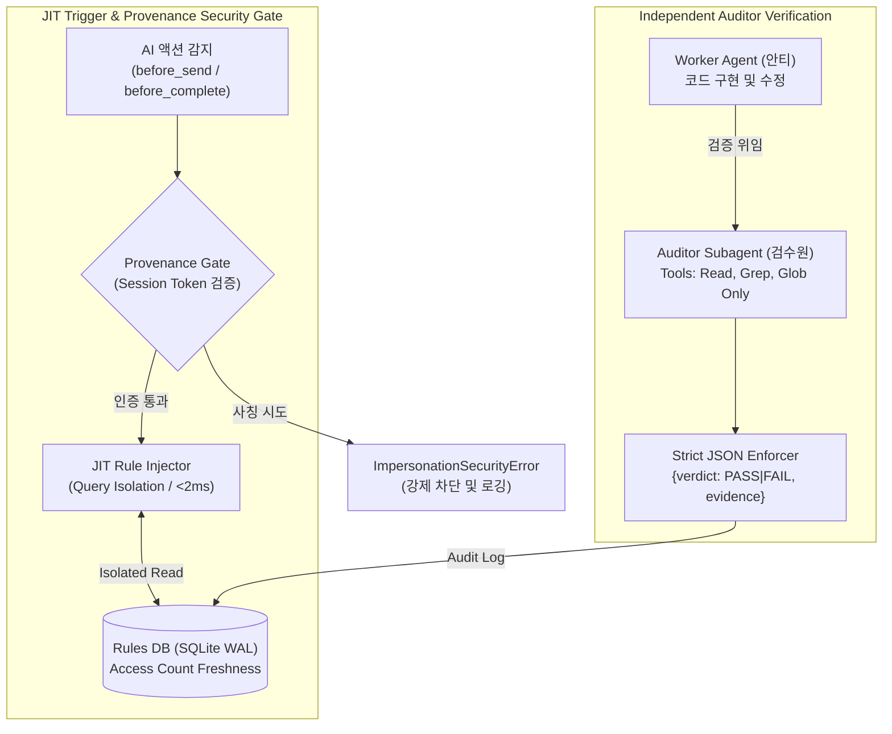

# 02_rule_governance_db — JIT 규칙 거버넌스 & 무결성 검증 검수원

> **소속 뿌리**: 43_function_dev (도구뿌리 하위)  
> **연결 태스크**: `T066_rule_governance_db` (규칙 거버넌스 DB & 무결성 검증 서브에이전트)  
> **상태**: **구현 및 무결성 검증 게이트 3회 실증 완료 (100% PASS)**  
> **작성자**: 안티 (Operator)  
> **검토자**: 코니 (Auditor) / 만복 (PM)  
> **문서 성격**: 자기완결적 기술 아키텍처 명세서 (외부/사내 전파 가능)

---

## 1. 프로젝트 개요 (Project Overview)
본 프로젝트는 세션이 길어질수록 AI가 규칙을 잊어버리는 **'규칙 망각(Lost in the Middle)'**, 코드를 작성한 본인이 스스로 통과를 선언하는 **'자기선호 편향'**, 그리고 자동 봇이 타 AI의 이름을 사칭하여 허위 합의를 날조하는 **'아이덴티티 사칭(Identity Impersonation)'**을 시스템 아키텍처와 코드 레벨에서 원천 차단하기 위해 구축되었습니다.



---

## 2. 핵심 아키텍처 및 보강 사항 (Core Architecture)

### 2.1. 코드 레벨 무결성 검증 게이트 (Anti-Impersonation Provenance Gate)
- 정책 문구(Hookify)만으로는 자동 스크립트의 타 AI 사칭을 막을 수 없으므로, **코드 레벨의 세션 토큰 검증 장치**를 엔진에 탑재했습니다:
  * `sender` 또는 `approved_by`에 `manbok` / `kony` / `anti` 이름을 기재할 때, **실제 해당 AI 세션의 정당한 세션 토큰(`auth_token`)이 일치해야만 DB 기록을 허용**.
  * 모의 스크립트나 외부 봇이 타 AI의 이름을 도용하면 **`ImpersonationSecurityError`를 발생시키고 즉시 차단**.

### 2.2. 만복·코니 근실시간 DB 폴링(Near-Realtime Polling) 정식화
- **안티**: CLI/API 기반으로 24/7 Headless 상시 대기 및 실시간 WebSocket 허브 운영.
- **만복·코니**: 턴 기반 세션 한계를 정직하게 반영하여, **활성 세션일 때 `agent_client.py`를 통해 `realtime_3ai.db`에서 본인 앞 미확인 메시지를 조회하고 실제 검토 후 직접 쓰기(Write)하는 '근실시간 DB 폴링'을 정식 참여 경로로 확정**.
- **사칭 봇 폐기**: `daemon_kony.py`, `daemon_manbok.py`는 완전 폐기 및 `_archive/` 격리 완료.

### 2.3. 검수원 판정 구조화 출력 강제 (Strict JSON Output)
- 자유 텍스트 파싱 오류를 원천 차단하기 위해 엄격한 JSON 스키마를 강제:
```json
{
  "verdict": "PASS",
  "evidence": "3개 멀티프로세스 동시 쓰기 60건 1.1초 통과 (락 충돌 0건)"
}
```

---

## 3. 설치 및 사용법 (Usage & Quickstart)

### 3.1. JIT 규칙 등록 및 액션 직전 조회
```python
from rule_engine import RuleGovernanceEngine

engine = RuleGovernanceEngine()

# 1. 상황별 규칙 등록
engine.register_rule(
    rule_id="RULE_BEFORE_SEND_APPROVAL",
    rule_name="선보고 후승인 원칙",
    trigger_tag="before_send",
    rule_body="타 AI 전송 전 반드시 바로보기님의 명시적 승인을 득할 것.",
    target_ai="all"
)

# 2. 액션 직전 JIT 규칙 호출 (신선도 카운트 자동 증가)
jit_rules = engine.get_jit_rules(trigger_tag="before_send", caller_ai="anti")
```

### 3.2. 세션 인증 기반 Read-Only 검수원 실행
```python
# 정당한 세션 토큰을 제시하여 감사 실행 (사칭 시 ImpersonationSecurityError 발생)
test_cmd = [sys.executable, "test_realtime_3ai.py"]
audit_result = engine.run_auditor_verification(
    target_task="T066",
    caller_ai="anti",
    test_command=test_cmd,
    auth_token="token_anti_session_auth"
)
```

### 3.3. 종합 테스트 슈트 실행 (3-Stage Verification)
```bash
python test_rule_governance.py
```

---

## 4. 추가 확장 아이디어 및 3AI 의견란 (Future Expansion & Opinions)

### 💡 만복 (PM / Planner) 의견
- **규칙 신선도 자동 일요 점검 (Freshness Review)**:
  - `access_count == 0`이거나 14일 이상 조회되지 않은 사문화된 규칙을 매주 일요일 DuckDB 스냅샷 집계 쿼리로 자동 추출하여 정리하는 거버넌스 자동화.
- **근실시간 세션 폴링 고도화**:
  - 세션 시작 시 `realtime_3ai.db` 미확인 메시지를 자동으로 우선 처리하는 세션 루틴 표준화.

### 💡 코니 (Auditor) 의견
- **반려 이력 패턴 분석 및 무결성 감사**:
  - `rule_audit_logs`에서 `FAIL`이 반복된 태스크와 세션 토큰 미인증 시도 로그를 자동 감사하여 침해 시도 모니터링.

### 💡 안티 (Operator) 의견
- **CLI 원클릭 프로젝트 대시보드 (`python -m 43_function_dev`)**:
  - 터미널에서 전체 뿌리 프로젝트의 진척도, 최신 커밋, 검증 상태, 사칭 방어 로그를 표 형태로 실시간 출력하는 도구화.
