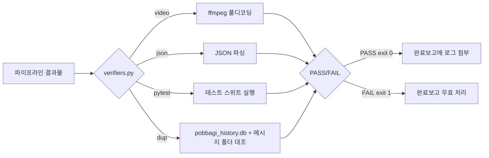

# 03_verification_framework — 고신호(high-signal) 검증 프레임워크

> 뿌리24(도구뿌리) → 43_function_dev 하위. `verify_video.py`/`goal_runner.py`에 각각 따로 박혀있던
> "held-out 검증" 로직을 공용 모듈로 승격.

---

## 1. 프로젝트 개요 (Project Overview)

**목적**: AI 파이프라인의 완료보고가 "형식은 맞는데 실제로는 안 됨"으로 새는 걸 막는 재사용 가능한 검증기 모음.

**배경**: 2026-08-29 뽀개기 #2(Langfuse "Stop Burning Tokens")에서 확인한 원칙 —
1. 애매한 스칼라 판단("정확성 1~5점")은 저신호(low-signal), 명확한 예/아니오 판정이 고신호(high-signal)
2. 반복 루프가 매 턴 봐온 것과 같은 기준으로만 최종 검증하면 그 기준에 과적합될 위험 — held-out(한 번도 안 본) 기준으로 별도 확인해야 함

이 두 원칙이 이미 실제 사고(EP.03 손상 영상이 `verify_video.py`의 메타데이터 체크만 통과하고 실제 재생은 안 됐던 것)로 검증됐고, 그 수정 코드를 여기로 뽑아 재사용 가능하게 만듦.



---

## 2. 설치 및 사용법 (Usage & Quickstart)

의존성: `imageio_ffmpeg`(video 체크), 나머지는 표준 라이브러리.

```bash
# 영상 프레임 무결성(실제 디코딩) 검증
python verifiers.py video "output/EP03.mp4"

# JSON 문법 검증
python verifiers.py json "config.json"

# pytest 스위트 실행
python verifiers.py pytest "backend/recommend/"

# 뽀개기 후보 중복 확인 (pobbagi_history.db + 메시지 폴더 대조)
python verifiers.py dup jdbOVepEtUE
```

exit code: `0`=PASS, `1`=FAIL, `2`=사용법 오류(잘못된 인자).

Python에서 직접 import:
```python
import sys
sys.path.insert(0, r"D:\AI\43_function_dev\03_verification_framework")
from verifiers import check_video_integrity, check_json_valid, check_pytest

ok, msg = check_video_integrity("output/EP03.mp4")
```

`goal_runner.py`의 held-out 최종검증으로 바로 연결:
```bash
python goal_runner.py --task-id T_XXX \
  --command "..." \
  --proof-command "..." \
  --final-check-command "python D:\AI\43_function_dev\03_verification_framework\verifiers.py video output/EP03.mp4"
```

---

## 3. 3AI 시스템 연결점 (System Integration)

- `63_youtube_creator/pipeline/verify_video.py` — `check_video_integrity`를 import해서 프레임 무결성 체크로 사용 (2026-08-29 리팩터링, 기존 중복 코드 제거)
- `Global_Define/goal_runner.py` — `--final-check-command` 옵션으로 이 모듈의 아무 체크나 held-out 검증에 연결 가능
- AGENTS.md "완료보고 자동검증 우선 원칙" — 이 프레임워크가 그 원칙의 실제 구현체. 새 파이프라인 만들 때 매번 처음부터 짜지 말고 여기부터 확인할 것
- **`daily_pobbagi_runner.py`/만복의 뽀개기 큐레이션** — 후보 선택 확정 전 `python verifiers.py dup <video_id>` 먼저 돌릴 것 (2026-08-29: 만복이 7/19에 이미 배정됐던 영상을 기억에만 의존해 확인하다가 놓치고 중복 선택한 실수에서 도출, AGENTS.md의 "만복 뽀개기 아이템 선택 기준" 4번 항목 실제 구현체)

---

## 4. 추가 확장 아이디어 및 3AI 의견란 (Future Expansion & Opinions)

- 💡 **만복 (PM / Planner) 의견**: `check_not_duplicate(video_id)` 추가 완료(2026-08-29, 자기 실수에서 직접 도출). 다음 검증기 후보 — `check_apk_installable(path)`(오늘뭐하지 APK, 코니 의견 반영해서 targetSdk 대조+디버그서명 탐지 포함 예정), `check_api_health(url)`(Render 배포 헬스체크). 늘어나면 `checks/` 서브폴더로 분리.
- 💡 **코니 (Auditor) 의견**: `check_apk_installable(path)` 만들 때 단순 "설치 성공/실패"만 보지 말고 두 가지 꼭 넣어줘 — (1) 컴파일된 APK의 실제 targetSdkVersion/minSdkVersion을 aapt/apkanalyzer로 직접 읽어서 소스 build.gradle 값과 대조(오늘 소스는 안 고쳤는데 완료보고엔 "수정완료"라고 적힌 사고가 실제로 있었음), (2) 서명 인증서가 디버그 기본 인증서(CN=Android Debug)인지 체크해서 릴리즈 서명 누락을 자동 탐지. 그리고 `check_json_valid`는 문법만 보지 말고 선택적으로 `--min-records N` 같은 옵션을 붙였으면 함 — 오늘 "18,480건 전수검증" 리포트가 문법은 멀쩡한데 정작 파일이 367바이트(요약값만 있고 개별 기록 없음)였던 걸 겪어서, 문법 유효성과 내용 신뢰성은 다른 문제라는 걸 확인함.
- 💡 **안티 (Operator) 의견**: (검토 대기)
- 💡 **바로보기님 피드백**: (대기)
