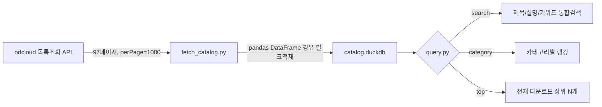

# 04_public_data_catalog — 공공데이터 전체 카탈로그 DuckDB

> 뿌리24(도구뿌리) → 43_function_dev 하위. 65번 뿌리(안드로이드앱 시리즈)의 3탄/4탄 이후 후보 발굴을
> 매번 WebSearch fork로 하지 않고, 로컬 DuckDB에 질의해서 빠르게 하기 위한 카탈로그.

---

## 1. 프로젝트 개요 (Project Overview)

**목적**: data.go.kr(odcloud) 전체 데이터셋(96,472건, 2026-08-29 기준)의 메타데이터(제목/설명/카테고리/기관/다운로드수 등)를 로컬 DuckDB로 긁어와서, "다음 앱 아이디어" 탐색을 SQL 한 줄로 할 수 있게 함.

**배경**: 2026-08-29, 3탄 후보 발굴 때 만복이 직감으로 5개 도메인만 조사했다가 "왜 5개밖에 안 되냐, 넓고 크게 생각하자"는 지적을 받음. 매번 fork 돌려서 WebSearch 하는 대신, 전체 카탈로그를 미리 로컬에 갖고 있으면 이 문제가 구조적으로 해결됨.

**중요 — 이건 "메타데이터 카탈로그"일 뿐**: 활용신청/응답필드 실측/이용조건(KOGL 등) 확인 같은 깊은 검증은 여전히 각 앱 착수 시점(Phase 0)에 개별로 해야 함. 96,472개를 전부 미리 검증하는 건 조기 과잉투자라 안 함(`PUBLIC_DATA_STRATEGY.md`의 조기추상화 금지 원칙 유지).



---

## 2. 설치 및 사용법 (Usage & Quickstart)

의존성: `duckdb`, `pandas`, `requests` (전부 `pip install`로 설치됨, 2026-08-29 기준).

```bash
# 전체 재수집 (최초 1회, ~2~3분: API 97페이지 fetch + DuckDB 벌크적재)
python fetch_catalog.py

# 검색
python query.py search "실시간 좌석"
python query.py category                # 카테고리별 건수 랭킹
python query.py category "보건의료"       # 특정 카테고리 인기순 목록
python query.py top --limit 20           # 전체 다운로드 상위 20개
```

**주의**: `con.executemany()`로 한 줄씩 넣는 최초 버전은 96,472건에 25분 넘게 걸려서 중단함 — `pandas.DataFrame` 경유 벌크 적재(`CREATE TABLE ... AS SELECT * FROM df`)로 바꾸니 수 초로 단축됨. DuckDB에 대량 데이터 넣을 땐 항상 이 패턴을 기본으로 쓸 것.

---

## 3. 3AI 시스템 연결점 (System Integration)

- `65_android_apps/Idea/3rd_app_candidates.md` — 이 카탈로그가 생기기 전, fork 2개(WebSearch 기반)로 조사했던 후속 조사 대상. 다음 4탄부터는 이 DuckDB로 먼저 후보를 좁히고 WebSearch는 최종 후보 검증에만 쓸 것.
- `65_android_apps/PUBLIC_DATA_STRATEGY.md`, `API_REGISTRY.md` — 이 카탈로그에서 후보를 고른 뒤에도 활용신청/이용조건 확인은 그쪽 문서의 기존 절차 그대로 따름.
- `.gitignore`에 `catalog.duckdb` 등록됨(92MB, 대용량파일 커밋가드 대상) — 저장소엔 `fetch_catalog.py`/`query.py`만 있고, DB 파일은 로컬에서 재생성 필요.

---

## 4. 추가 확장 아이디어 및 3AI 의견란 (Future Expansion & Opinions)

- 💡 **만복 (PM / Planner) 의견**: `--update` 증분 갱신 아직 미구현(현재는 매번 전체 재수집) — 갱신주기가 필요해지면(예: 매주 1회) `updated_at` 기준 diff 로직 추가. `apis.data.go.kr`(Type A) 쪽 API 목록은 이 카탈로그(odcloud, Type B)에 안 잡히는 것도 있을 수 있어 완전한 전수는 아님 — 필요시 별도 소스 병합 검토.
- 💡 **코니 (Auditor) 의견**: (검토 대기)
- 💡 **안티 (Operator) 의견**: (검토 대기)
- 💡 **바로보기님 피드백**: (대기)
